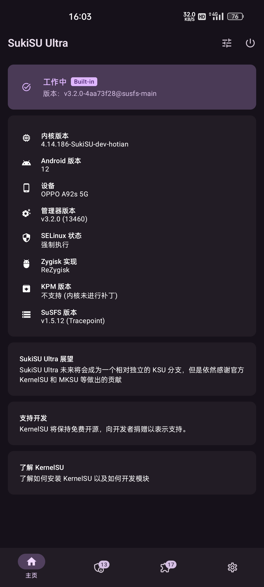

## 内核更改 - manual钩子

使用sukisu 提供的钩子补丁


可在侧边直接下载文件。
- 或复制粘贴文件内容


在内核源码下使用指令

```
patch -p1 < “文件名称”.patch
```


运行后可能无法完全正确修补在内核文件中，
在指令执行后的提示中可以看到。

出现了3个未能修补到内核的文件中的代码文件 .rej
请根据.rej文件中的绿色代码部分来复制粘贴到文件中正确的位置来更改

 如果需要使用KPM功能请在文件
 arch/arm64/configs/(构建内核时使用的配置文件)
添加以下配置

```markdown
CONFIG_KPM=y
CONFIG_KALLSYMS=y
CONFIG_KALLSYMS_ALL=y
```

:::tip
编译请自行根据其他教程
进行 本地/云端 编译
:::
## 配置/模块教程

> 在安装管理器后打开可看见类似以下界面


:::important[模块推荐]
如果需要可装模块
- TrickyStore
隐藏bl和Google的证书伪装
如果需要方便的控制可加装 Tricky-Addon-Update-Target-List 模块
此模块的页面中可直接全选应用后再使用去除不需要选择的应用功能
或如一键工具Yurikey Manager等其他一键工具可直接设置有效的密钥等功能

- PlayIntegrityFix
我可能推荐 inject-s 版？

- ReZygisk相关
目前最新sukisu rezygisk(版本423)无法使用，
使用使用旧版本才能使用

- ZygiskNext
新版本能够继续使用可能和有版本检测问题

其他模块请根据需求添加需要的模块
:::
### 使用HMA教程

>使用前需要添加xp模块框架，目前可使用 LSPosed-it/其他的旧LSPosed源代码 fork后更改的xp模块框架

> 进入lsp框架主页，在底部的中间按钮“概述”的左边为我们的模块界面
> 依次点击（模块⇒应用隐藏列表）
> 根据提示的推荐应用，勾选系统框架
> 按下提示上的重启手机
> 手机重启后我们进入应用隐藏列表

> 如果成功，则进入时在页面上方会显示模块已经激活（版本3.6）
> （大概HMA-OSS也一样？）
#### 配置黑名单模板

> 进入主页的”模板管理“选项
> 我们选择”创建黑名单模板“
>这时会显示”0个应用不可见“，”已应用于0个应用“
>（记得填写模板名称，不然突然退出可能会丢失配置）
>
> - ”0个应用不可见“
> 进入此项的“编辑列表”此选项中选择的是我们需要隐藏的应用，
> 可自由选择，右上角···按钮中可可开启系统应用选择
> 
>-  ”已应用于0个应用“
>-  进入此项的“编辑列表”，此选项是选择隐藏应用需要对哪些应用隐藏

:::warning[HMA设置？]
在设置中的 模块 分类中的 数据隔离
切记如果不需要则不要开启“Vold app Data 隔离”选项
下面的“为所有应用启用数据隔离”可根据环境开启
:::